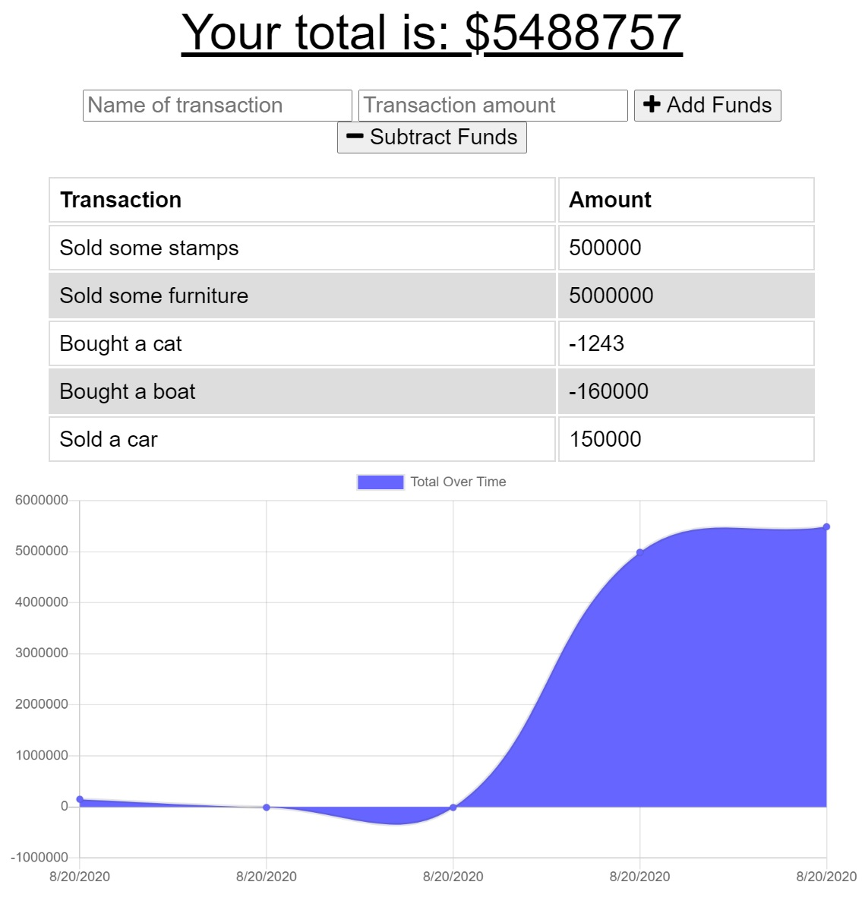

# Brad Pritchett's Offline Database

This application allows users to record financial transactions into a database that can be updated offline. 

## Demo
[View on Heroku](https://morning-harbor-59764.herokuapp.com/)

## Build
This application is built with:
[NodeJS](https://nodejs.org/en/)([MongoDB](https://www.mongodb.com/)

## Authors
[Brad Prichett](https://github.com/bradpritchett)

## Contributing
Pull requests are welcome. For major changes, please open an issue first to discuss what you would like to change.

Please make sure to update tests as appropriate.

## License
[ISC](https://choosealicense.com/licenses/ISC/)